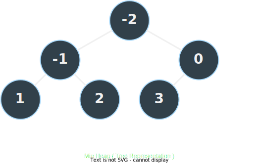

# Heap Data Structure
This is my implementation of a standard computer science heap data structure. Both **max** and **min** heaps have been implemented.

## Description
<p align="center">
  
</p>

A heap data structure stores data in order (non-increasing or non-decreasing). Each data item is stored in a node, which can either have two children, a parent, or both. The order (heap invariant) is maintained from root to base, and while modifying the heap (inserting or removing) the invariant may be violated, in which case we re-heapify from root to base or from a node to the root.

## API
1. `new(heap_type)` - Instantiates a new heap data structure (either min/max heap)
2. `size()` - Returns the size of the heap
3. `is_empty()` - Returns true only if the heap is empty, false otherwise
4. `insert(node)` - Inserts a node into the heap
5. `remove()` - Removes the root node

## Usage
Basic usage of a heap data structure to sort the data vector in a min-heap order (non-decreasing)
```rust
use heap_ds::heap::{Heap, HeapType};
let data = vec![1, -2, 2, 3, -1, 0];
let mut heap_ds = Heap::new(HeapType::Min);

// insert data into the heap
for node in data {
  heap_ds.insert(node)
}

// remove the root node
heap_ds.remove() // -2
```
